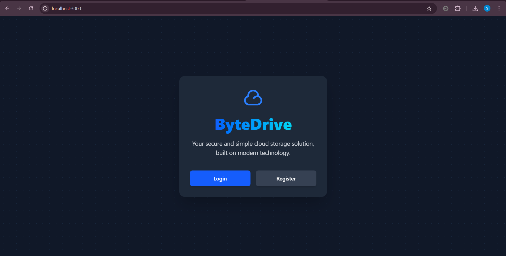

# 🚀 ByteDrive – A Secure Cloud Storage Application

ByteDrive is a full-stack cloud storage application inspired by Google Drive and Dropbox. It allows users to securely upload, view, organize, and manage files using a private nested folder structure. Supabase powers authentication, database, and storage.

---

## 🌐 Live Demo

[👉 Click here to view the live demo](https://bytedrive-app.onrender.com/) 



---

## ✨ Core Features

- ✅ **User Authentication** with Supabase Auth
- 🔐 **JWT Session Management** using secure HTTP-only cookies
- 📁 **User-Specific Private Storage** (Row-Level Security applied)
- 🧩 **File CRUD Operations**:
  - Upload files to root or folders
  - Preview images, download files
  - Delete files securely
- 🗂️ **Nested Folder Management**:
  - Create, move, and navigate folders
  - Dynamic breadcrumbs for navigation
- 🎨 **Responsive UI** using TailwindCSS + Flowbite
  - Image previews
  - Icons for generic files
  - Pop-up file upload modal

---

## 🏗️ Tech Stack

| Layer               | Tech                                  | Description                                                                 |
|--------------------|----------------------------------------|-----------------------------------------------------------------------------|
| **Backend**         | Node.js, Express.js                   | REST API and server logic                                                  |
| **BaaS**            | Supabase                              | Auth, PostgreSQL DB, and file storage in one platform                      |
| **Auth**            | Supabase Auth                         | Sign up, login, JWT-based sessions                                         |
| **Storage**         | Supabase Storage                      | S3-compatible object storage                                               |
| **DB Security**     | Row-Level Security (RLS)              | SQL policies ensure users can only access their own data                   |
| **Frontend**        | EJS (Server-side rendered HTML)       | Simple, dynamic HTML rendering                                             |
| **Styling**         | TailwindCSS, Flowbite, Remix Icons    | Utility-first styling, prebuilt components                                 |
| **Dev Tools**       | Nodemon, Concurrently                 | Auto-restart server and parallel Tailwind build                            |

---

## 🚀 Getting Started

### 1. 📦 Clone the Repository

```bash
git clone https://github.com/your-username/ByteDrive.git
cd ByteDrive
npm install


2. ⚙️ Set Up Supabase
Go to supabase.com and create a new project.

Copy:

Project URL from Project Settings > API

Service Role Key from the same page

Create a public storage bucket (e.g. byte-drive) under Storage.

Configure RLS Policy:

Go to Storage > Policies > [your bucket]

Create policy:
Name: User can manage their own folder
Allowed operations: SELECT, INSERT, UPDATE, DELETE
Target role: authenticated
USING expression:

   (bucket_id = 'your-bucket-name' AND (storage.foldername(name))[1] = 'uploads' AND (storage.foldername(name))[2] = (auth.uid())::text)

3. 🔐 Configure Environment Variables
Create a .env file in the root:
# Supabase Config
SUPABASE_ENDPOINT=https://your-project.supabase.co/storage/v1/s3
SUPABASE_SECRET_KEY=your-supabase-service-role-key
SUPABASE_BUCKET=byte-drive

# Optional
JWT_SECRET=your-jwt-secret

4. ▶️ Run the Application
npm start

🧠 Key Learnings & Highlights
Supabase as a BaaS: Authentication, database, and storage without managing infrastructure.

Row-Level Security (RLS): SQL-based access rules enforced directly at the database layer.

EJS Rendering: Secure and fast server-rendered UI generation.

Streamlined Dev Workflow: Tailwind + Nodemon via Concurrently.

📁 Folder Structure Overview
ByteDrive/
├── routes/                 # Express routers
├── utils/                  # Supabase upload logic
├── views/                  # EJS frontend views
├── public/                 # Static assets (e.g., CSS, icons)
├── app.js                  # Main server file
├── .env                    # Environment variables
└── README.md
